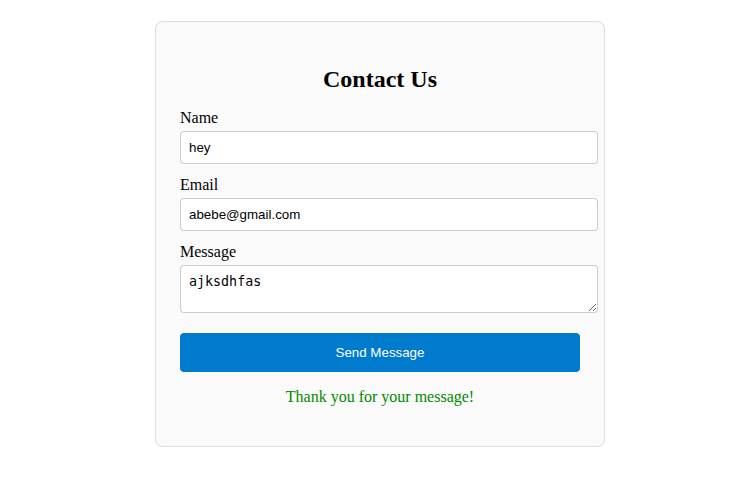

# React Contact Form

A fully-typed, accessible, and responsive contact form built with React, TypeScript, and the `react-hook-form` library. This project demonstrates how to manage form state, validation, and user feedback with minimal boilerplate.

## Table of Contents

- [Demo](#demo)  
- [Features](#features)  
- [Tech Stack](#tech-stack)  
- [Project Structure](#project-structure)  
- [Installation](#installation)  
- [Usage](#usage)  

## Demo




## Features

- Fully typed with TypeScript  
- Name, Email, and Message fields  
- Real-time validation with custom error messages  
- Disabled submit button during submission  
- Success feedback on successful submission  
- Responsive and accessible markup/ARIA attributes  

## Tech Stack

- React 18+  
- TypeScript  
- react-hook-form  
- CSS Modules (or plain CSS)  
- Vite / Create React App (whichever you prefer)  

## Project Structure

```bash
src/
├─ components/
│  ├─ ContactForm.tsx
│  └─ ContactForm.css
├─ App.tsx
├─ index.tsx
├─ styles/
└─ assets/
```

## Installation

Clone the repository:

```bash
git clone https://github.com/Ludis-et/Project-Phase.git
cd 'Task 5'
```

Install dependencies:

```bash
npm install
# or
yarn install
```

## Usage

Start the development server:

```bash
npm start
# or
yarn start
```