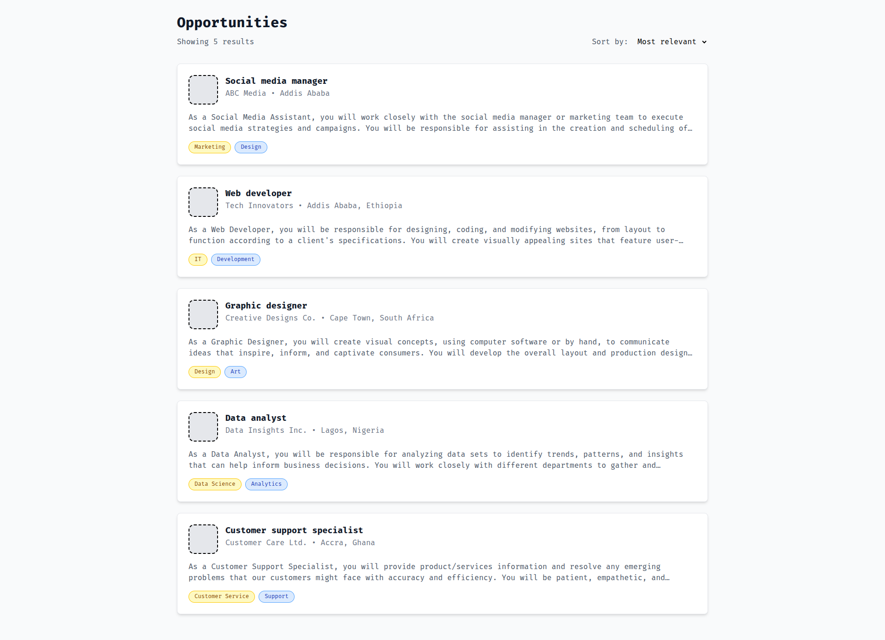
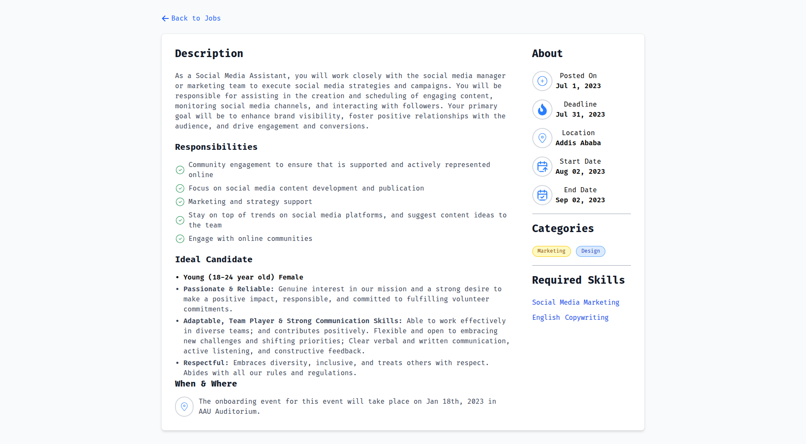

# Overview  
This is a modern job listing application built with React and Tailwind CSS that allows users to browse job opportunities and view detailed job descriptions. The application features a responsive design, intuitive navigation, and a clean user interface.  

## Features  
- **Job Listing Dashboard**: View all available job opportunities  
- **Detailed Job View**: See comprehensive job descriptions, responsibilities, requirements, and ideal candidate profiles  
- **Responsive Design**: Works seamlessly on desktop, tablet, and mobile devices  
- **Intuitive Navigation**: Easily navigate between job listings and detailed views  
- **Tag-based Organization**: Jobs are categorized with tags for easy filtering  
- **Clean UI**: Modern interface with Tailwind CSS styling  

## Screenshots  
- **Job Listing Dashboard**  
    
- **Job Detail View**  
    

## Technologies Used  
- **React (v18)** - JavaScript library for building user interfaces  
- **Tailwind CSS (v3)** - Utility-first CSS framework  
- **React DOM** - Package for DOM rendering  
- **JavaScript ES6+** - Modern JavaScript features  
- **HTML5** - Markup language for structure  
- **CSS3** - Styling language for presentation  

## Installation  
To run this application locally, follow these steps:  

1. Clone the repository:  
   ```bash  
   git clone https://github.com/Ludis-et/Project-Phase.git
  cd 'Task 6' 
   ```  

2. Install dependencies:  
   ```bash  
   npm install  
   ```  

3. Start the development server:  
   ```bash  
   npm start  
   ```  

4. Open your browser and visit:  
   ```
   http://localhost:3000  
   ```  

## Project Structure  
```text  
src/  
├── components/  
│   ├── JobCard.jsx      # Component for job listing cards  
│   └── JobDetails.jsx   # Component for detailed job view  
├── pages/  
│   └── JobListingPage.jsx # Main page with job listings  
├── App.js               # Root application component  
├── index.js             # Entry point  
└── index.css            # Global styles  
```  
 

## Usage  
- On the main dashboard, browse through available job listings  
- Click on any job card to view detailed information  
- Use the "Back to Jobs" button to return to the listing page  
- Sort jobs using the "Most relevant" dropdown (functionality to be implemented)  
