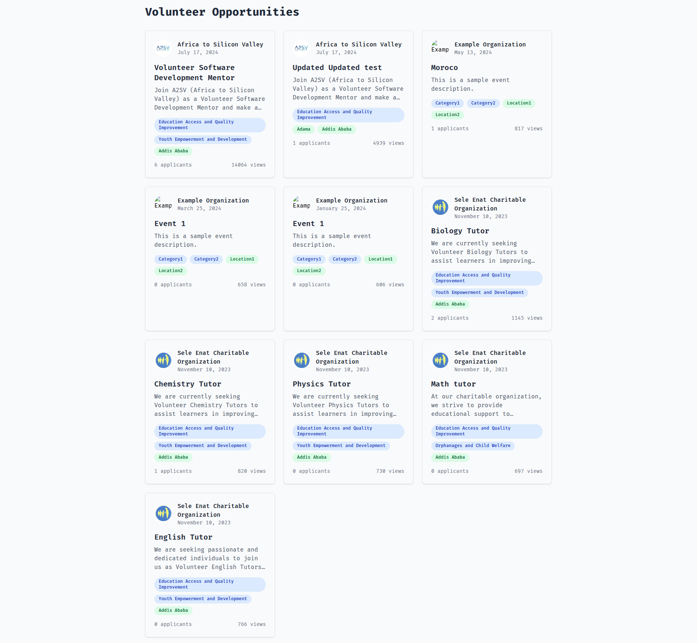
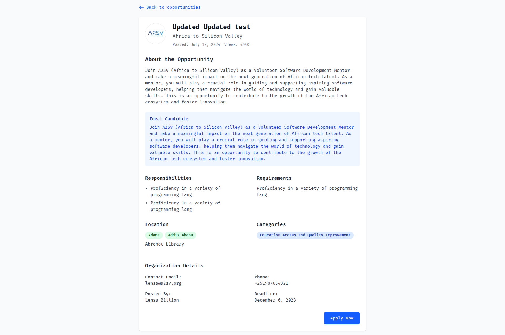

# Volunteer Opportunities Platform  

A React-based web application for browsing and viewing volunteer opportunities with beautiful UI and smooth loading states.  

## Features  
- **Opportunity Listing Page**: View all available volunteer opportunities in a responsive grid.  
- **Opportunity Detail Page**: See detailed information about each opportunity.  
- **Skeleton Loading**: Smooth loading states for better user experience.  
- **Responsive Design**: Works on all device sizes.  
- **Type Safety**: Built with TypeScript for better code quality.  

## Screenshots  
### Opportunity Listing Page  
  
Listing page showing available volunteer opportunities with organization logos, titles, and key information.  

### Opportunity Detail Page  
  
Detailed view of a volunteer opportunity with all relevant information.  

## Installation  
Clone the repository:  
```bash  
git clone https://github.com/Ludis-et/project-phase.git  
cd 'task 7'  
```  
Install dependencies:  
```bash  
npm install  
```  
Start the development server:  
```bash  
npm start  
```  
Open your browser to:  
```
http://localhost:3000  
```  

## Technologies Used  
- React 18  
- TypeScript  
- React Router 6  
- Tailwind CSS  
- Fetch API for data fetching  

## Project Structure  
```
src/  
├── App.tsx  
├── pages/  
│   ├── OpportunityList.tsx  
│   └── OpportunityDetail.tsx  
├── components/  
│   └── SkeletonLoader.tsx  
├── types/  
│   └── opportunity.ts  
└── api/  
  └── client.ts  
```  

## API Integration  
The application expects the following API endpoints:  
- `GET /opportunities/search` - Returns list of all opportunities.  
- `GET /opportunities/:id` - Returns details for a specific opportunity.  

Update the base URL in `src/api/client.ts` to point to your actual API.  

## Available Scripts  
In the project directory, you can run:  
- `npm start`: Runs the app in development mode.  
  Open [http://localhost:3000](http://localhost:3000) to view it in your browser.  