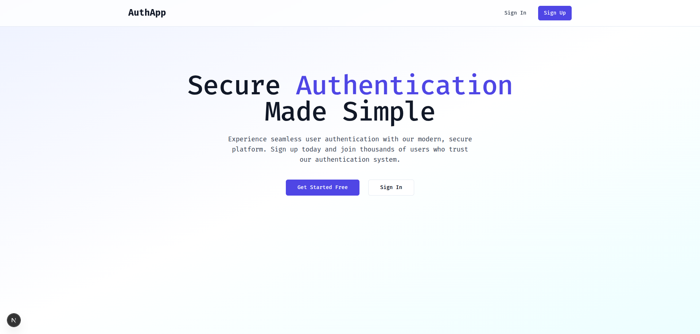
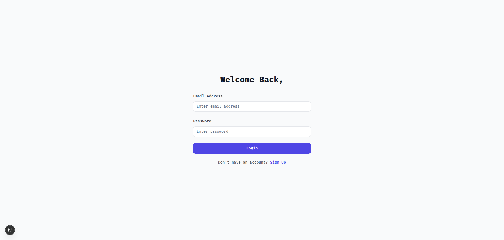
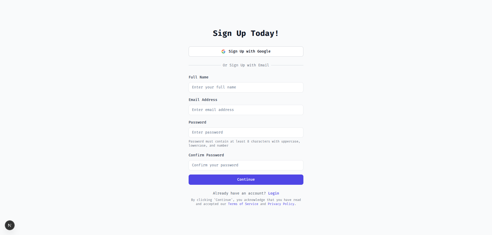
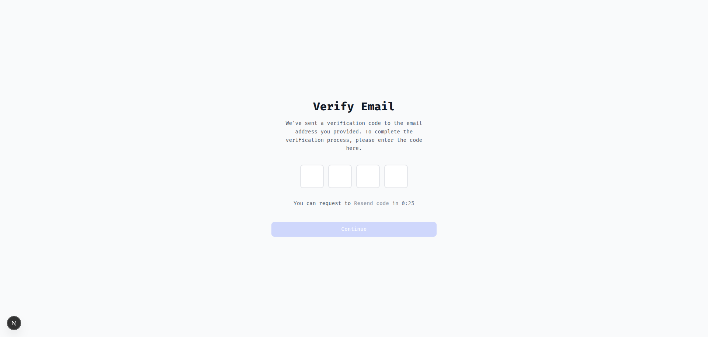

# AuthApp - Next.js Authentication System

A modern, secure user authentication application built with **Next.js 15**, **TypeScript**, and **Tailwind CSS**. This application provides complete user registration, email verification, and sign-in functionality using the Akil Backend API.

## 🚀 Features

- **User Registration**: Secure signup with email verification
- **Email Verification**: OTP-based email verification system
- **User Sign In**: Secure login with JWT token management
- **Modern UI**: Beautiful, responsive design with Tailwind CSS
- **Form Validation**: Client-side validation for all input fields
- **Error Handling**: Comprehensive error handling and user feedback

## 🏗️ Tech Stack

- **Framework**: Next.js 15 with App Router + TypeScript
- **Authentication**: NextAuth.js (Auth.js) with Credentials Provider
- **Styling**: Tailwind CSS 3
- **UI Components**: Radix UI + Shadcn/ui
- **State Management**: React Context API + NextAuth Session
- **Form Handling**: React Hook Form + Yup Validation
- **Notifications**: Sonner Toast
- **Backend API**: Akil Backend (https://akil-backend.onrender.com/)

## 📁 Project Structure

```
app/                          # Next.js App Router pages
├── layout.tsx               # Root layout with providers
├── page.tsx                 # Homepage (/)
├── signin/page.tsx          # Sign in page (/signin)
├── signup/page.tsx          # Sign up page (/signup)
├── verify-email/page.tsx    # Email verification (/verify-email)
└── globals.css              # Global styles and Tailwind CSS

components/                   # Reusable UI components
├── ui/                      # Shadcn/ui component library
└── providers/               # Context providers for client components

contexts/                     # React Context for state management
├── AuthContext.tsx          # Legacy authentication context (deprecated)
└── NextAuthContext.tsx      # NextAuth.js authentication context

hooks/                        # Custom React hooks
└── use-toast.ts             # Toast notification hook

lib/                         # Utility functions
├── utils.ts                 # Tailwind class utilities
├── auth.ts                  # NextAuth configuration
└── validationSchemas.ts     # Yup validation schemas

shared/                      # Shared types and interfaces
└── api.ts                   # API types and interfaces
```

## 📱 Application Pages

### 1. Homepage / Landing Page


**Route**: `/` (app/page.tsx)

### 2. Sign In Page


**Route**: `/signin` (app/signin/page.tsx)

### 3. Sign Up Page


**Route**: `/signup` (app/signup/page.tsx)

### 4. Email Verification Page


**Route**: `/verify-email` (app/verify-email/page.tsx)

## ✅ Form Validation with Yup + React Hook Form

## 🔐 NextAuth.js Integration

## 🚀 Getting Started

1. Clone the repository
2. Install dependencies: `npm install`
3. Start development server: `npm run dev`
4. Open http://localhost:3000 in your browser

Create a `.env.local` file in the root directory:

```bash
# NextAuth.js Configuration
NEXTAUTH_URL=http://localhost:3000
NEXTAUTH_SECRET=your-secret-key-change-this-in-production
```